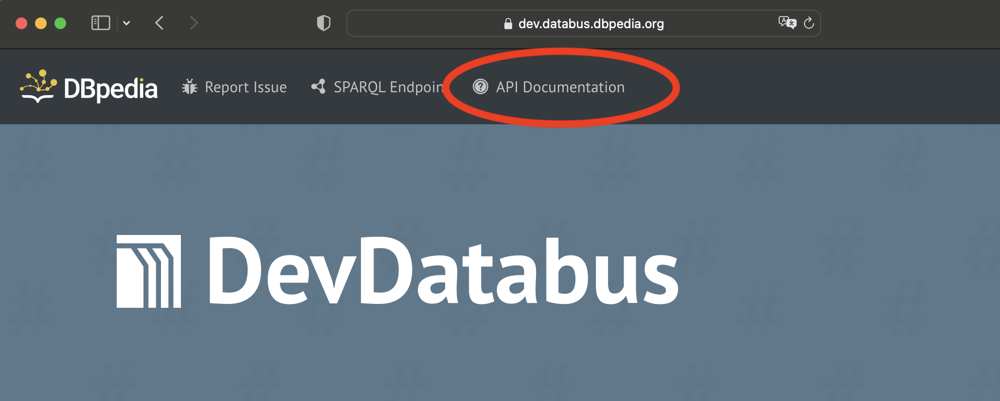

# Databus API

Databus API specification is available clicking on the corresponding link in the header of the main page in the web-interface. The API is using OpenAPI Specification. You can try it out also on our dev server [here](https://dev.databus.dbpedia.org/api/).


### Creating an API Token

Once the Databus has been started with the correct configuration, you can use the login button on the web interface to log in to your OIDC provider account. Once you are successfully logged in, you can navigate to your account page by using the 'My Account' button on the landing page or using the dropdown in the upper right corner of the screen.

You will be asked to specify a namespace. Choose this namespace carefully, as it will be visible in all your databus URIs. The namespace can only be changed by an admin later.

Navigate to the settings tab on your account page and scroll to the 'API Keys' section. Enter a display name for your API key (this is only for better distinguishability) and click 'Create' to create the key. You can use the copy icon on the API key to copy the key value to your clipboard.

Use any API key in the `x-api-key` header of your API calls to authenticate yourself.

The following examples of the API usage use a non-existing example databus at `https://databus.example.org`. The user performing the requests will be John who is using the namespace `john`. John has already created an API token on his account page with a value of `27b29848-69c6-4eaf`.

### Input Validation Workflow

Most API calls can be used to create, change or delete data on the Databus. This includes groups, artifacts and versions but also account information and Databus Collections.

Before saving your inputs to the database, they will be validated in 2 steps:

1) **Construct Query:** A construct query is executed on your RDF input to only select the needed triples. This prevents users from inserting unneeded information. 
2) **SHACL Validation** The result of the construct query is validated with SHACL constraints. This makes sure that the information in your input is complete and formatted correctly


## Accounts

### Update Account Information
```http
PUT /$username
```
#### Headers

| Header | Value |
| :--- | :--- | 
| x-api-key | **Required** Your Databus API Key |
| Content-Type | **Required** application/json | 

#### Parameters
| Parameter | Description |
| :--- | :--- | 
| `$username` | Your Databus username |

#### Body
* The input data must be supplied as JSON-LD 
* The input data will be filtered with this [construct query](./server/app/common/queries/constructs/construct-account.sparql)
* The **filtered data** must conform to these [SHACL shapes](./server/app/common/shacl/dataid-shacl.ttl)


## Groups

### Create / Update Group
```http
PUT /$username/$group
```
#### Headers

| Header | Value |
| :--- | :--- | 
| x-api-key | **Required** Your Databus API Key |
| Content-Type | **Required** application/json | 

#### Parameters
| Parameter | Description |
| :--- | :--- | 
| `$username` | Your Databus username | 
| `$group` | The target group identifier |

#### Body
* The input data must be supplied as JSON-LD 
* The input data will be filtered with this [construct query](./server/app/common/queries/constructs/construct-group.sparql)
* The **filtered data** must conform to these [SHACL shapes](./server/app/common/shacl/group-shacl.ttl)
* The uri of the dataid:Group has to match the request uri. 

#### Example:
John wants to create the group `general` to later publish some of his artifacts. He issues the following `PUT` request:

```
curl -X PUT -H "Content-Type: application/json" -H "x-api-key: 27b29848-69c6-4eaf" -d "./group.jsonld" https://databus.example.org/john/general
```

The contents of the file `./group.jsonld` are the following:

```
{
  "@id": "https://databus.example.org/john/general",
  "@type": "http://dataid.dbpedia.org/ns/core#Group",
  "http://purl.org/dc/terms/title": {
    "@value": "General",
    "@language": "en"
  },
  "http://purl.org/dc/terms/abstract": {
    "@value": "General artifacts.",
    "@language": "en"
  },
  "http://purl.org/dc/terms/description": {
    "@value": "This group contains various general artifacts.",
    "@language": "en"
  }
}
```

Note that the *@id* of the supplied graph has to be the same as the request uri. Additionally, the uri has to be in John's namespace `john`.


## Datasets (Artifacts and Versions)

Databus artifacts and versions can be created implicitly by sending a DataId document to the Databus API. 

A [DataId](http://dataid.dbpedia.org/ns/core.html) is an RDF metadata document with an entity of rdf:type [dataid:Dataset](http://dataid.dbpedia.org/ns/core#Dataset) at its heart. The contents of the document then associate the Dataset with 
* The containing files and their metadata
* A Databus version
* A Databus artifact
* A Databus group

While Databus **groups** have to be created by a separate API call, Databus **artifacts** and **versions** information need to be put into the DataId document.

### Create / Update Version

```http
PUT /$username/$group/$artifact/$version
```
#### Headers
| Header | Value |
| :--- | :--- | 
| x-api-key | **Required** Your Databus API Key |
| Content-Type | **Required** application/json | 

#### Parameters
| Parameter | Description |
| :--- | :--- | 
| `$username` | Your Databus username |
| `$group` | The group identifier for your artifact version |
| `$artifact` | The artifact identifier for your artifact version |
| `$version` | The version identifier for your artifact version |

#### Body
* The input data must be supplied as JSON-LD 
* The input data will be filtered with this [construct query](./server/app/common/queries/constructs/construct-version.sparql)
* The **filtered data** must conform to these [SHACL shapes](./server/app/common/shacl/dataid-shacl.ttl)
#### Responses
| Status Codes | Status | Description |
| :--- | :--- | :--- | 
| 200 | `OK` | Artifact version updated |
| 201 | `CREATED` | Artifact version created | 
| 400 | `BAD REQUEST` | Request or request data was formatted incorrectly | 
| 403 | `FORBIDDEN` | Invalid API Token or request targetting the namespace of another user | 
| 500 | `INTERNAL SERVER ERROR` | Internal server error | 

### Remove Version

```http
DELETE /$username/$group/$artifact/$version
```
#### Headers
| Header | Value |
| :--- | :--- | 
| X-Api-Token | **Required** Your Databus API Key |
#### Responses
| Status Codes | Status | Description |
| :--- | :--- | :--- | 
| 204 | `NO CONTENT` | Artifact version deleted successfully |
| 403 | `FORBIDDEN` | Invalid API Token or request targetting the namespace of another user | 
| 500 | `INTERNAL SERVER ERROR` | Internal server error | 

## Generic

Alternatively to the specific API calls, you can merge the RDF content you want to publish into a single input. The following API call will then try to find Databus entities in your input automatically.

### Add Content

```http
PUT /system/publish
```
#### Headers
| Header | Value |
| :--- | :--- | 
| x-api-key | **Required** Your Databus API Key |
| Content-Type | **Required** application/json | 

#### Body
* The input data must be supplied as JSON-LD 
* The input data will be filtered with the following construct queries
  * [Construct group](./server/app/common/queries/constructs/construct-group.sparql) query
  * [Construct version](./server/app/common/queries/constructs/construct-version.sparql) query
* Each construct query result will then be validated with their corresponding SHACL shape (e.g. group construct query result validated by group SHACL shapes)
  * [Group SHACL](./server/app/common/shacl/group-shacl.ttl) shapes
  * [Version SHACL](./server/app/common/shacl/dataid-shacl.ttl) shapes

#### Responses
| Status Codes | Status | Description |
| :--- | :--- | :--- | 
| 200 | `OK` | Content created or updated |
| 400 | `BAD REQUEST` | Request or request data was formatted incorrectly | 
| 403 | `FORBIDDEN` | Invalid API Token or request targetting the namespace of another user | 
| 500 | `INTERNAL SERVER ERROR` | Internal server error | 
