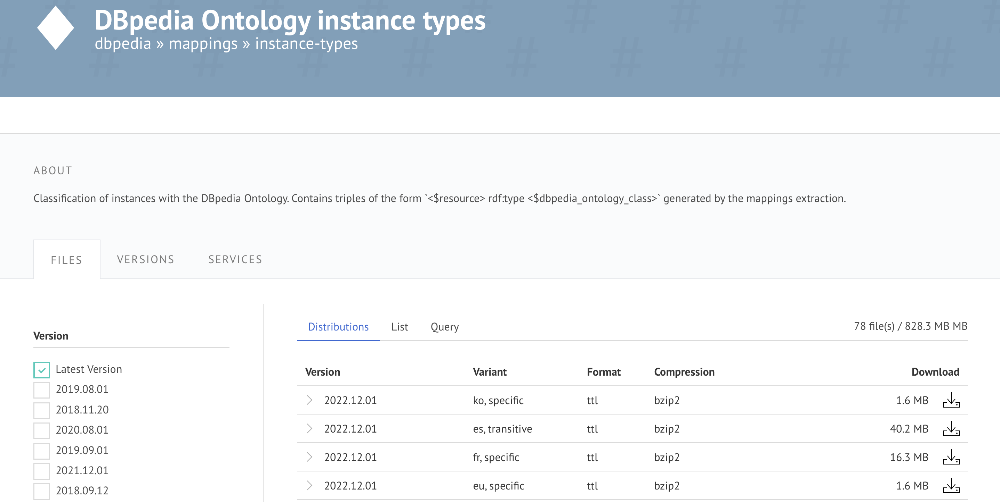
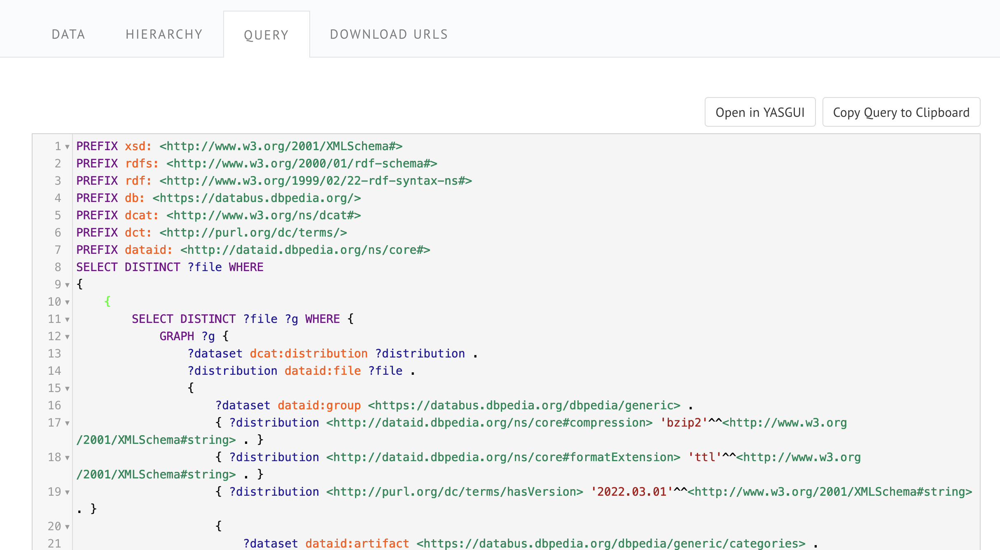

# Databus Data Download Guide

## About this guide
This guide walks you through the process of downloading data from the Databus.

## What will you learn
You will learn different ways and techniques of downloading data from the Databus. We will cover how to:

* Technique 1: Use the Databus UI do download data
* Technique 2: Query Databus data download links using SPARQL
* Technique 3: Access data on the Databus via Linked Data
* Technique 4: Access Databus data via Collections and SPARQL
* Technique 5: Download data using the Databus client (todo)
* Technique 6: Download data using a simple bash script
* Technique 7: Download and load data in the Virtuoso triple store (todo)

## What you need
* Not more than 15 min of time for each technique
* Favorite text editor or IDE
* Terminal (console) with Unix capabilities
* rapper RDF parsing and serializing command line tool


### Technique 1: Use the Databus UI do download data
First, navigate to the Databus UI and find relevant data.

The main Databus endpoint is running at https://databus.dbpedia.org  which hosts the DBpedia Knowledge Graph as well as many other valuable datasets.

For example, you can navigate to “instance types” dataset https://databus.dbpedia.org/dbpedia/mappings/instance-types/ 

<figure><figcaption></figcaption></figure>

Next, using the filters on the left side, you can narrow the results, by selecting a specific version or language. Lets select version 2021.12.01 and language “en”. This will provide two distributions (i.e. files) which satisfy our criteria.

<figure><figcaption></figcaption></figure>

To download the particular file,  just click on the download link logo

You're done, now you should have the data on your machine and you start using it.

### Technique 2: Query Databus data download links using SPARQL
The SPARQL query language gives you flexibility and freedom when querying data on the Databus.

With SPARQL you can write simple queries to collect all artifacts published under some group but also do other much more complex queries such as retrieving the users that published the most number of datasets in a specific time period.

In the following example we will put together a SPARQL query that will return the download links associated with the particular artifact and specific version.

Let's assume we want to retrieve the download links for the `instance-types` artifact, published by the `dbpedia` account and under the group `mappings`. The version that we want is `2022.12.01`.

The identifier for such an artifact is following: https://databus.dbpedia.org/dbpedia/mappings/instance-types/2022.12.01

Note that the identifiers have hierarchical structure. To learn more about the [URI Design](https://dbpedia.gitbook.io/databus/model/uridesign) article which explains the detail the Databus URIs.

After we have the URI identifier we need to write the query. This, also, however, requires knowledge about the Databus Model.
In short, the Databus Model defines following core concepts:
* Group - consolidates one or more artifacts.
* Artifact - represents a logical dataset in the DBpedia Databus platform
* Version - represents a state of the artifact at certain point of time 
* Part - each artifact can consists of one or more files, which are modelled as parts

For complete details of the Databus Model check the [Databus Ontology](https://dataid.dbpedia.org/databus/core.html#).

In our example, we already know the identifier of the artifact and its version so the only thing we need to query are the download links of the files associated with our artifact.

In the Databus model the Version(s) is linked to the data Part(s) via the `dcat:distribution` property.
While the download links are provided for each part using the `dcat:downloadURL`.

We have all the information we need, so lets write the SPARQL query.

```sparql

PREFIX databus: <https://dataid.dbpedia.org/databus#>
PREFIX dcat:   <http://www.w3.org/ns/dcat#>
​
SELECT DISTINCT ?downloadUrl WHERE {
  GRAPH ?g {
    <https://databus.dbpedia.org/dbpedia/mappings/instance-types/2022.12.01> dcat:distribution ?part .
    ?part dcat:downloadURL ?downloadUrl .
  }
}
```

Lets also run the query against the [Databus SPARQL endpoint](https://databus.dbpedia.org/repo/sparql) and retrieve the list of download URLs for all the files associated with the dataset with the identifier.

If the SPARQL query is passed and processed successfully, you should receive a list of download links.

If this is the case, then congratulations, you learned how to query Databus with SPARQL!

### Technique 3: Access data on the Databus via Linked Data
Linked Data is a mechanism for publishing structured data on the Web. Databus implements the Linked Data principles which allows us to access the data on the Databus as Linked Data.
Lets try this on an example where we will retrieve data for the download link for the instance types dataset published on the Databus.

First, you would need to open your terminal application.

Then, write a command using the cURL command line tool. Here is the command for the “instance types” dataset.

`curl -L https://databus.dbpedia.org/dbpedia/mappings/instance-types/2021.12.01 -H "Accept: text/turtle"`

By running the command should receive a valid RDF representation of version 2021.12.01 of the `instance types` artifact.
The **format of the results** is the RDF turtle serialization format. However, you can also retrieve the results in other formats. For this you would need to change the value of the **Accept header** in the cURL command.
For example:
* Accept: `application/json` - for results in JSON
* Accept: `text/ntriples` - for the results in the N-triples serialization format

Next, you can dig in the data, grab the download links encoded using the databus:downloadURL properties, and finally, use the download links to download the data.

You are done.

### Technique 4: Access Databus data via Collections and SPARQL
Databus collections group user specified data artifacts on the databus in logical and queryable units called collections. The allow users to associate together different datasets together.

Let's have a look at one example of a collection which is available at the Databus at

`https://databus.dbpedia.org/dbpedia/collections/dbpedia-snapshot-2022-03`

This collection groups together all the datasets published as part of the DBpedia snapshot as of March 2022. All datasets associated with this collection are listed on the dedicated web page.

The datasets associated with the collection can be retrieved using SPARQL. Each collection is described with a SPARQL query. The SPARQL query for the dbpedia-snapshot-2022-03 collection can be retrieved by opening the QUERY tab. The SPARQL query is rather long so we don't provide it here due to space constraints but you can easily find it at the collection page.

<figure><figcaption></figcaption></figure>

Now when you have the SPARQL query in hands, you can submit it using the Databus SPARQL endpoint at https://databus.dbpedia.org/repo/sparql and retrieve all download links for the datasets associated with this collection.

Extra tip: you can also retrieve the SPARQL query by submitting the following curl command:

`curl -H "Accept:text/sparql" https://databus.dbpedia.org/dbpedia/collections/dbpedia-snapshot-2022-03`

Great, you are done here!

### Technique 5: Download data using the Databus client (todo)

### Technique 6: Download data using a simple bash script
Downloading data using a bash script is maybe the most convenient way of retrieving data from the Databus.

In the following example, we will prepare a bash script that will automatically download all datasets associated with a defined Databus collection. The Databus collection is dbpedia-snapshot-2022-03 which groups together the datasets associated with the DBpedia 2022-03 release.

First, create an empty text file and name it `download.sh` or something similar (note the extension which should be `.sh`).

Next copy the following lines of code and put them as part of the bash script.

```
query=$(curl -H "Accept:text/sparql" https://databus.dbpedia.org/dbpedia/collections/dbpedia-snapshot-2022-03)
files=$(curl -H "Accept: text/csv" --data-urlencode "query=${query}" https://databus.dbpedia.org/repo/sparql | tail -n+2 | sed 's/"//g')
while IFS= read -r file ; do wget $file; done <<< "$files"
```

The bash script will do following:
* Retrieve the SPARQL query associated with the collection
* Submit the SPARQL query to the Databus SPARQL endpoint and retrieve a list of download URLs in the CSV format.
* Finally, the script uses the wget command line tool to retrieve the files from the download server. It downloads each file and stores them on your computer.

Finally, let’s try the script and execute it. To execute the script run:

`sh download.sh`

Note: should you have used another name for the script, accordingly adjust the command.

Great, you have now downloaded the datasets associated with the dbpedia-snapshot-2022-03 collection.

Congrats, you have learnt another technique for downloading data from the Databus.

### Technique 7: Download and load data in the Virtuoso triple store (todo)


