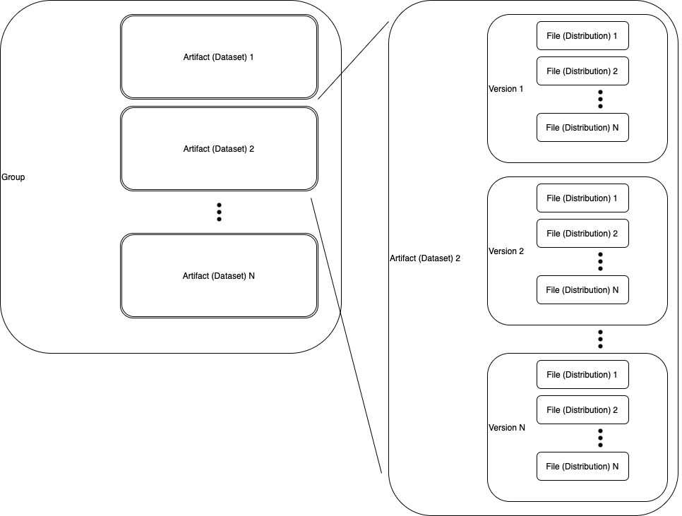

# How to Organise Your Data

### General Structure

As pointed out in the [use-cases section](../usecases.md),Databus can be seen as [_Maven_](https://maven.apache.org) _for data_. An important distinction to Maven, is that Databus does not store the data itself, but only metadata describing your data.

The prerequisite for using Databus is having some data you would like to publish. The data must be publicly accessible (for download) via URIs. Each URI should correspond to a single file.

The minimal entity for publishing is a dataset, which may consist of minimally one [file (Distribution)](../distribution.md). **If you want to publish a single file you will need to create a dataset with one file**.

In the Databus model a dataset corresponds to an [artifact](../artifact.md) and the artifacts are [versioned](../dataid.md). The artifacts are grouped together with [groups](../group.md), this enables better structure for big projects which may combine several datasets in one logical element. When you publish a dataset, you essentially publish its version. Versions are assumed for release cycle of your data, similarly to how software distributions are versioned.

Here is the visualisation of group/artifact/version/file relationship:&#x20;

<figure><figcaption></figcaption></figure>

### Creating Dataset Identifiers

Metadata for your Datasets is made available under a specific URI identifier, where certain path segments of that URI are shared between related (using groups) Datasets (see examples below). The identifiers reflect the above-mentioned group/artifact/version/file structure.

> **Note** Choosing descriptive names for your identifiers and putting thought into the partitioning of your metadata entries can greatly impact the understandability and usefulness of your data.

#### Identifier Hierarchy

The identifier URI hierarchy has the following levels:

* Account (Username)
  * [Group](../group.md)
    * [Artifact](../artifact.md)
      * [Version](../version.md)
        * [Distribution](../distribution.md)

Thus, the identifiers of your metadata entries on the Databus are a composite of two or more of the following:

1. The Databus **base URI** _(e.g. https://databus.dbpedia.org)_
2. Your **account name** for that Databus _(e.g. janfo)_
3. The **group name** _(e.g. animals)_
4. The **artifact name** _(e.g. cats)_
5. The **version name** _(e.g. 2023-03-30)_
6. The **distribution name** _(e.g. cats.ttl.bz)_

The full example identifiers would look like this:

* **Account** Identifier: https://databus.dbpedia.org/janfo
* **Group** Identifier: https://databus.dbpedia.org/janfo/animals
* **Artifact** Identifier: https://databus.dbpedia.org/janfo/animals/cats
* **Version** Identifier: https://databus.dbpedia.org/janfo/animals/cats/2023-03-30
* **Distribution** (file) Identifier: https://databus.dbpedia.org/janfo/animals/cats/2023-03-30/cats.ttl.bz

See more on the URI design [here](../uridesign.md).

#### Best Practices

The metadata publisher has complete control over the names of the Databus identifiers. Though, there are a few best practices to be considered:

1. **The account name**

* The account name can be chosen on account creation. It is advised to use your personal (nick)name or the name of your institution/company

2. **The group name**

* A group can be understood as folder for multiple related artifacts. Generally, it is recommended to create _one group for one project_ - the same way you would create a folder on-disk for a certain project. However, if a project requires a large amount of datasets (and thus, artifacts) it can be a good idea to use multiple groups.

3. **The artifact**

* an artifact consists of multiple versions of different files, but all the files should somehow be related, so an artifact should represent _data of one certain topic_.

5. **The version**:

* A version consists of multiple distributions, each representing a file and tracks the evolution of one artifact. There is a [whole page](../versioning.md) for versioning best practises.

7. **The distribution**

* One distribution represents one certain file in an artifact/version and is distinguished by others through [content variants](../content-variants.md). As the name suggests, in one artifact/version the files should somehow be closely related or even the same data in different flavors.
* Examples:
  * the same data in different languages or encodings/file types
  * a file and other files generated from that file
  * a file and other files describing that file
* Of course it is not always, but it is helpful to keep the names of content variants the same across versions of the dataset, which helps keeping SPARQL queries consistent
