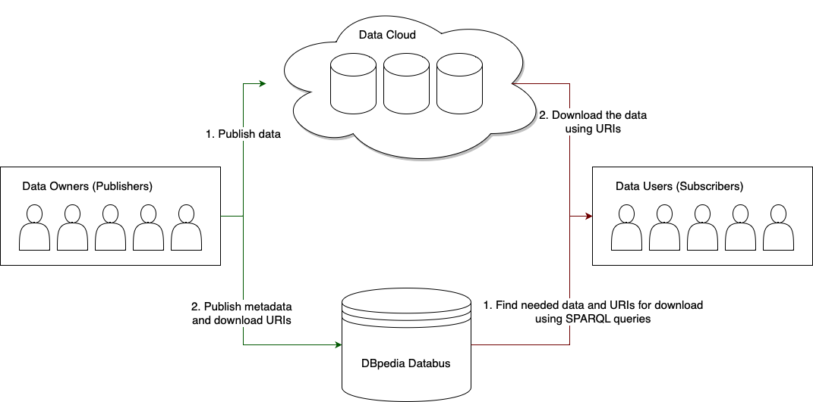

# Industrial Application Examples

Databus can be seen as a **data** repository (analogous to [software repositories](https://en.wikipedia.org/wiki/Software_repository), e.g. Maven or Pip). A key difference of Databus from a typical software repository is that it does not store the actual data (i.e. files on disk) but focuses solely on capturing metadata describing your data (i.e. what kind of files and where are they).

The idea is simple. Owners of the data upload the descriptions of their data and where to find it. Users of the data can find and download what they want and check out for updates if new versions of the data were uploaded. **This enables smooth continuous integration processes for your data.** 

## Archivo

[DBpedia Archivo](https://github.com/dbpedia/Archivo) is an online ontology interface and augmented archive, that discovers, crawls, versions and archives ontologies on the DBpedia Databus. Each Databus Artifact represents one certain ontology and each version represents a new version of the ontology. Archivo also performs SPARQL requests to Databus for obtaining links for crawling.

## Lookup

[DBpedia Lookup](https://github.com/dbpedia/dbpedia-lookup) is a generic entity retrieval service for RDF data. It can be configured to index any RDF data and provice a retrieval service that resolves keywords to entity identifiers. Lookup uses Databus for automating downloading the data indexed.

## Spotlight

[DBpedia Spotlight](https://github.com/dbpedia-spotlight/dbpedia-spotlight-model) is an open-source tool that helps annotate textual documents with DBpedia entity references. It leverages natural language processing and machine learning techniques to recognize and link mentions of entities to their corresponding DBpedia resources. 

## Virtuoso

[Virtuoso SPARQL Endpoint](https://github.com/dbpedia/virtuoso-sparql-endpoint-quickstart) creates and runs a Virtuoso Open Source instance including a SPARQL endpoint preloaded with a Databus Collection and the VOS DBpedia Plugin installed. The user specifies a collection URI and runs a docker container which downloads the data from the collection and saves it to [Virtuoso database](https://virtuoso.openlinksw.com)

## Open Energy Family W and Search

???

