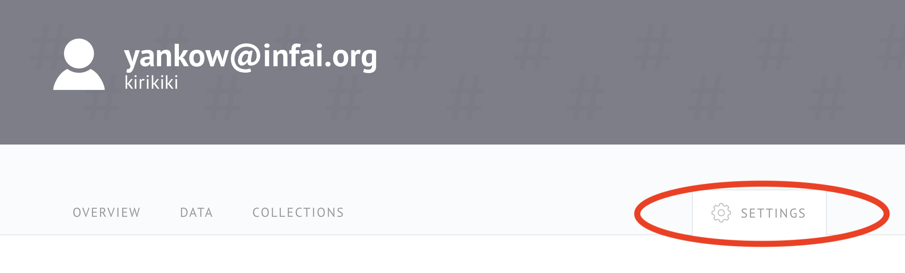

# Quickstart Examples

The API contains many methods for fine-grained data updates, in this chapter we will focus only on the main api which consists of publishing a dataset and querying metadata stored with SPARQL. Please refer to [API Docs](api-docs.md) for details.

## Creating an API Token

Once the Databus has been started with the correct configuration, you can use the login button on the web interface to log in to your OIDC provider account. Once you are successfully logged in, you can navigate to your account page by using the 'My Account' button on the landing page or using the dropdown in the upper right corner of the screen.


You will be asked to specify a namespace. Choose this namespace carefully, as it will be visible in all your databus URIs. The namespace can only be changed by an admin later.



Navigate to the settings tab on your account page and scroll to the 'API Keys' section. Enter a display name for your API key (this is only for better distinguishability) and click 'Create' to create the key. You can use the copy icon on the API key to copy the key value to your clipboard.

Use the API key in the `x-api-key` HTTP-header of your API calls to authenticate yourself.

## Generating Json-LD Inputs (Metadata)

Most API calls can be used to create, change or delete data on the Databus. This includes groups, artifacts and versions but also account information and Databus Collections.

You can generate your own example inputs by using the Web-UI of Publish Wizard, for example in our [dev Databus](https://dev.databus.dbpedia.org). **NOTE! In case you use you own Databus server, you will need to change all the URI prefixes in the generated Json-LD to yours, i.e. `https://dev.databus.dbpedia.org` -> `https://<your server>`!**


Before saving your inputs to the database, they will be validated in 2 steps:
1) **Construct Query:** A construct query is executed on your RDF input to only select the needed triples. This prevents users from inserting unneeded information.
2) **SHACL Validation** The result of the construct query is validated with SHACL constraints. This makes sure that the information in your input is complete and formatted correctly

## Examples

In the quickstart we use the minimal required input metadata for publishing a dataset on the Databus and a few SPARQL queries to demonstrate how the metadata can be integrated in your workflow.

### Publishing

The following example of use our dev Databus at `https://dev.databus.dbpedia.org/`.

In the following example we publish a minimal Json-LD with metadata about a test dataset containing our [README](https://raw.githubusercontent.com/dbpedia/databus/master/README.md) file.  

You need the execute the following HTTP request (we provide curl for it):

```shell
curl -X 'POST' \
  'https://dev.databus.dbpedia.org/api/publish?fetch-file-properties=true&log-level=info' \
  -H 'accept: application/json' \
  -H 'X-API-KEY: <your API key>' \
  -H 'Content-Type: application/ld+json' \
  -d '{
  "@context": "https://downloads.dbpedia.org/databus/context.jsonld",
  "@graph": [
    {
      "@type": [
        "Version",
        "Dataset"
      ],
      "@id": "https://dev.databus.dbpedia.org/<your username>/test_group/test_artifact/2023-06-13",
      "hasVersion": "2023-06-13",
      "title": "test dataset",
      "abstract": "test dataset abstract",
      "description": "test dataset description",
      "license": "https://dalicc.net/licenselibrary/Apache-2.0",
      "distribution": [
        {
          "@type": "Part",
          "formatExtension": "md",
          "compression": "none",
          "downloadURL": "https://raw.githubusercontent.com/dbpedia/databus/master/README.md"
        }
      ]
    }
  ]
}'
```

If the Databus should NOT infer a certain metadatum (for example not auto-generating the `abtract` from the `description` field), it can be set explicitly and the Databus will accept it (if it fits its criteria). For a full list of inferrable properties check out the [autocompletion page](../../auto-completion.md)

#### Property Description

This gives a quick overview on what to put in for the different keys. In which exact triples the data will result can be seen in the [JSON-LD context](https://downloads.dbpedia.org/databus/context.jsonld).

| Key          | Value                                                                                                                                                                                                                                                     | 
|--------------|-----------------------------------------------------------------------------------------------------------------------------------------------------------------------------------------------------------------------------------------------------------|
| @type        | The type of the graph. For the databus the types `Group`, `Artifact`, `Version`, `Dataset` and `Part` are permitted.                                                                                                                                      |
| @id          | This represents the `id` (subject) of the triples. In the case of a `Dataset` this is the identifier consists of `${DATABUS_BASE_URL}/user/group/artifact/version`. What those are exactly can be see at the [model documentation](../../model/README.md) |
| title        | This is a short title for the Dataset                                                                                                                                                                                                                     |
| description  | A longer description for the content of the dataset. Markdown syntax is supported.                                                                                                                                                                        |
| license      | The license of the dataset. Currently only one license as a URI is supported                                                                                                                                                                              |
| distribution | Contains a list of `Part`,  each representing a registered file.                                                                                                                                                                                          |
| downloadURL  | The location URL of the registered file.                                                                                                                                                                                                                  |
| dcv:key      | Set a value for a given key to individually identify a file and notate properties of a file. Example `"dcv:type": "rawdata"`                                                                                                                              |

### SPARQL Queries

After you have some data in Databus published you can execute SPARQL queries to filter out what you need.

For that you can use SPARQL endpoint interface or API method [`POST /sparql`](https://dev.databus.dbpedia.org/api/#/general/sparql-post).


Example query for retrieving list of all datasets in Databus:
```sparql
PREFIX dataid: <http://dataid.dbpedia.org/ns/core#>
PREFIX rdf:    <http://www.w3.org/1999/02/22-rdf-syntax-ns#>

SELECT DISTINCT ?dataset WHERE {
  GRAPH ?g {
    ?dataset rdf:type dataid:Version .
  }
}
```

Example Query for retrieving all files, their download location, format and size from a certain dataset (by knowing group, artifact and version)

```sparql
PREFIX dataid: <http://dataid.dbpedia.org/ns/core#>
PREFIX dcat:   <http://www.w3.org/ns/dcat#>

SELECT DISTINCT ?distribution, ?file, ?downloadUrl, ?format, ?byteSize WHERE {
  GRAPH ?g {
    <https://dev.databus.dbpedia.org/<your username>/test_group/test_artifact/2023-06-13> dcat:distribution ?distribution .
    ?distribution dataid:file ?file .
    ?distribution dcat:byteSize ?byteSize .
    ?distribution dataid:formatExtension ?format .
    ?distribution dcat:downloadURL ?downloadUrl .
  }
}
```

Example Query for retrieving the same information for the latest version of an artifact:

```sparql
PREFIX dataid: <http://dataid.dbpedia.org/ns/core#>
PREFIX dcat:   <http://www.w3.org/ns/dcat#>
PREFIX dct:    <http://purl.org/dc/terms/>

SELECT DISTINCT ?distribution, ?file, ?downloadUrl, ?format, ?byteSize WHERE {
    ?distribution dataid:file ?file .
    ?distribution dct:hasVersion ?version .
    ?distribution dcat:byteSize ?byteSize .
    ?distribution dataid:formatExtension ?format .
    ?distribution dcat:downloadURL ?downloadUrl .

  {
      SELECT (?v as ?version) { 
        ?dataset dataid:artifact <https://dev.databus.dbpedia.org/kirikiki/test_group/test_artifact> . 
        ?dataset dct:hasVersion ?v . 
  } ORDER BY DESC (?version) LIMIT 1 
}
}
```

#### Group/Artifact Metadata Example

In the minimal example metadata for the group is missing and the artifact is initialized with the metadata of the dataset. Both can be explicitly set for better documentation:

##### Group

```json
{
  "@id": "https://dev.databus.dbpedia.org/<your username>/test_group",
  "@type": "Group",
  "title": "Ontologies used in Project X" ,
  "abstract": "Collected ontologies to be used in Project X as dependencies for development.",
  "description": "Collected ontologies to be used in Project X as dependencies for development. The following work has beend done: \n1License was checked, all ontologies can be used in the project\n2. we created artifact using the original download location if the ontologies were ok, or we made a copy of a cleaned up version."
}
```

curl:

```shell
curl -X 'POST' \
  'https://dev.databus.dbpedia.org/api/publish?fetch-file-properties=true&log-level=info' \
  -H 'accept: application/json' \
  -H 'X-API-KEY: <your API key>' \
  -H 'Content-Type: application/ld+json' \
  -d '{
  "@context": "https://downloads.dbpedia.org/databus/context.jsonld",
  "@graph": [
    {
      "@id": "https://dev.databus.dbpedia.org/<your username>/test_group",
      "@type": "Group",
      "title": "Ontologies used in Project X" ,
      "abstract": "Collected ontologies to be used in Project X as dependencies for development.",
      "description": "Collected ontologies to be used in Project X as dependencies for development. The following work has beend done: \n1License was checked, all ontologies can be used in the project\n2. we created artifact using the original download location if the ontologies were ok, or we made a copy of a cleaned up version."
    }
  ]
}'
```

##### Artifact

```json
{
    "@id": "https://dev.databus.dbpedia.org/<your username>/test_group/test_artifact",
    "@type": "Artifact",
	"title": "The DBpedia Ontology" ,
	"abstract": "Versions of DBpedia ontologies for Project X",
	"description": "This description is different from the DBpedia Ontology Dataset description, so describe the overarching goal of the Artifact. Should be similar to the description of each Dataset."
}
```

curl:
```shell
curl -X 'POST' \
  'https://dev.databus.dbpedia.org/api/publish?fetch-file-properties=true&log-level=info' \
  -H 'accept: application/json' \
  -H 'X-API-KEY: <your API key>' \
  -H 'Content-Type: application/ld+json' \
  -d '{
  "@context": "https://downloads.dbpedia.org/databus/context.jsonld",
  "@graph": [
    {
    "@id": "https://dev.databus.dbpedia.org/<your username>/test_group/test_artifact",
    "@type": "Artifact",
	"title": "The DBpedia Ontology" ,
	"abstract": "Versions of DBpedia ontologies for Project X",
	"description": "This description is different from the DBpedia Ontology Dataset description, so describe the overarching goal of the Artifact. Should be similar to the description of each Dataset."
    }
  ]
}'
```

**NOTE**: As well as in the minimal example section the `abstract` can be inferred from the `description` field!


