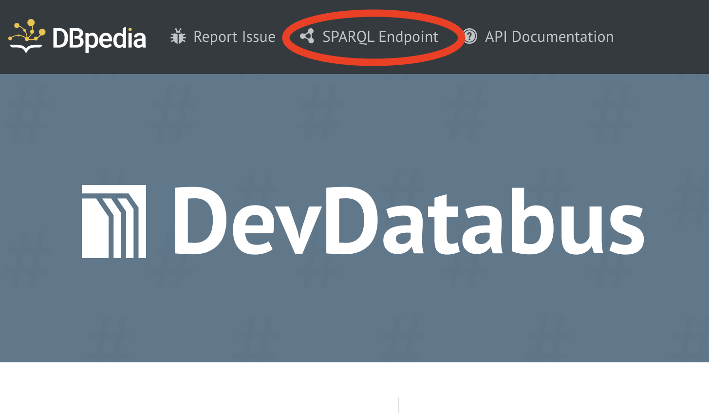

# Web Interface

Databus has a rich Web-interface which allows users to [publish](publish.md) their data and then query it using [collections](collections.md). SPARQL endpoint can be used as an alternative option to using collections.

