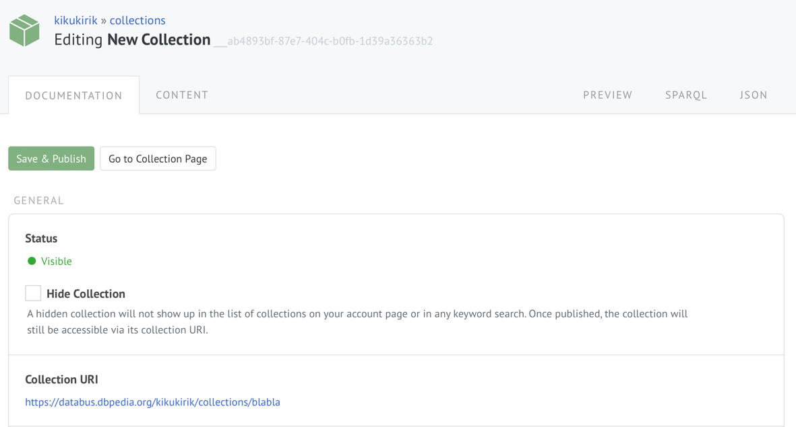
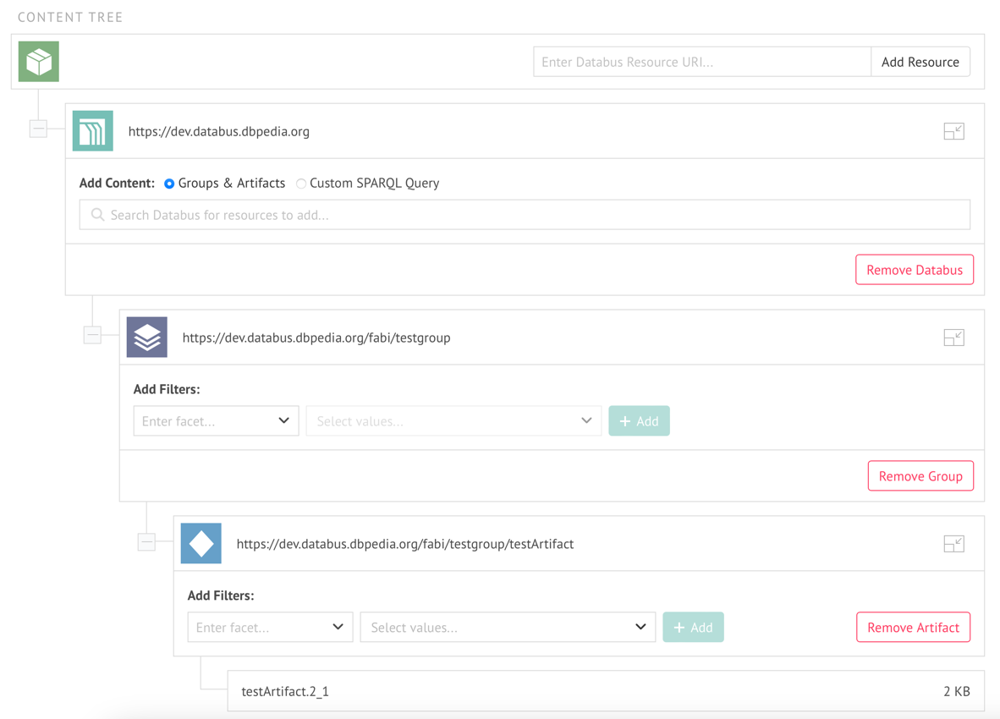
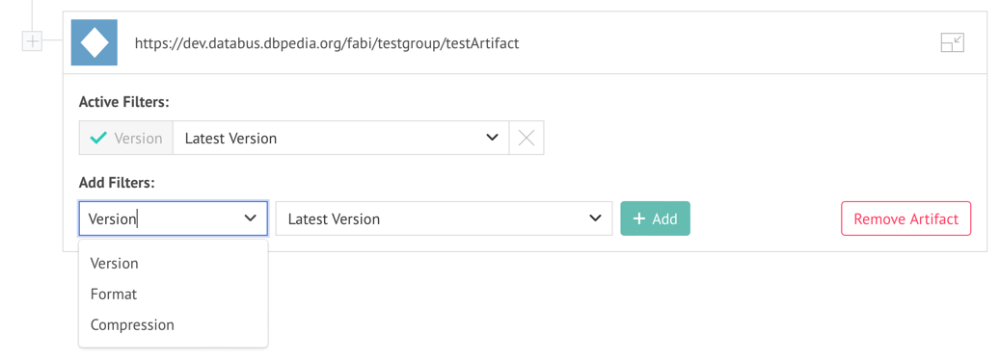
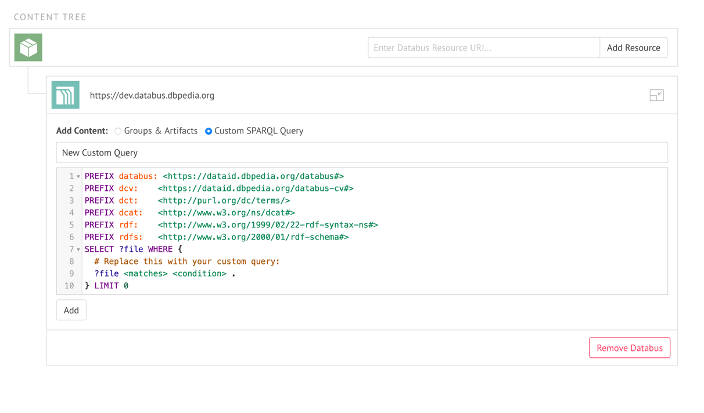

# Collections

A collection is basically a labelled SPARQL query that is retrievable via URI. Hence, with the collection editor UI you can group Databus groups and artifacts into a bundle and publish your selection using your Databus account, and it generates the corresponding SPARQL query automatically. It is now a breeze to select the data you need, share the exact selection with others and/or use it in existing or self-made applications.

If you are not familiar with SPARQL and data queries, you can think of the feature as a shopping cart for data: You create a new cart, put data in it and tell your friends or applications where to find it. Quite neat, right?

In the following section, we will cover the user interface of the collection editor.

## Use Cases

The DBpedia Databus Collections are useful in many ways.

* You can share a specific dataset with your community or colleagues.
* You can re-use dataset others created
* You can plug collections into Databus-ready applications and avoid spending time on the download and setup process
* You can point to a specific piece of data (e.g. for testing) with a single URI in your publications
* You can help others to create data queries more easily


## The Editor UI

Firstly, you can find the collection editor by hovering over the username icon and clicking on "Collections".

Click on "Create New" and the collection editor will open:


On the "Documentation" tab you need to give your new collection an Id. There you can also edit its visibility status, give it a title and add a description. 

**NOTE! The edits are not saved automatically to the server, you need to click "Save and Publish" button every time you need the changes to be saved. Otherwise, the changes are store locally in the cache of your browser.**

After the first publish your collection receives an URI generated from its Id. Following the URI will take you to the HTML representation of your collection that will be visible to others. Hitting the Edit button in the action bar will bring you back to the editor.

## Collection Hierarchy

Let’s have a look at the core piece of the collection editor: the hierarchy view.



On the top of the hierarchy is the list of the Databus nodes. You can add other Databus nodes to make federated collections containing data from several Databus instances.

For each of the Databus instances a collection can contain a bundle of different groups and artifacts but is not limited to that. If you know how to write a SPARQL query, you can easily extend your collection with more powerful selections. Therefore, the hierarchy for each of the instances is split into two categories of nodes:

* Generated Queries ("Groups & Artifacts"): Contains queries that are generated from your selection in the UI
* Custom Queries ("Custom SPARQL Query"): Contains custom written SPARQL queries

When you want to add content to your collection you need pick between the categories and then use the corresponding menu to edit the content.

## Generated Queries
Clicking the "Groups & Artifacts" will take you to a search field. Make use of the indexed search on the Databus to find and add the groups and artifacts you need. If you want to refine your search, you can do that in the next step.


Once the artifact or group has been added to your collection, the Add to Collection button will turn green. Once you are done you can go back to the Editor with Back to Hierarchy button.

Your hierarchy will now contain several new nodes.

### Group Facets, Artifact Facets and Overrides

Group and artifacts that have been added to the collection will show up as nodes in the hierarchy. Clicking a node will open a filter where you can refine your dataset selection. Setting a filter to a group node will apply it to all artifact nodes unless you override that setting in any artifact node manually.



A group node will provide a list of filters that will be applied to all artifacts of that group. Artifact nodes will then actually select data files which will be visible in the faceted view. The facets are generated dynamically from the available variants declared in the metadata.

## Custom Queries
If you hit on the "Custom SPARQL Queries", a new node called “Custom Query” will appear in the hierarchy. You can remove a custom query by clicking on the corresponding button. If you click the node it will take you to a SPARQL input field where you can edit the query.



To make your collection more understandable for others, you can document your query by adding a label and description.

A collection query is a SPARQL query of the form:
```sparql
SELECT DISTINCT ?file WHERE {
{
[SUBQUERY]
}
UNION
{
[SUBQUERY]
}
UNION
...
UNION
{
[SUBQUERY]
}
}
```

All selections made by generated and custom queries will be joined into a single result set with a single column called “file“. Thus it is important that your custom query binds data to a variable called “file” as well.

